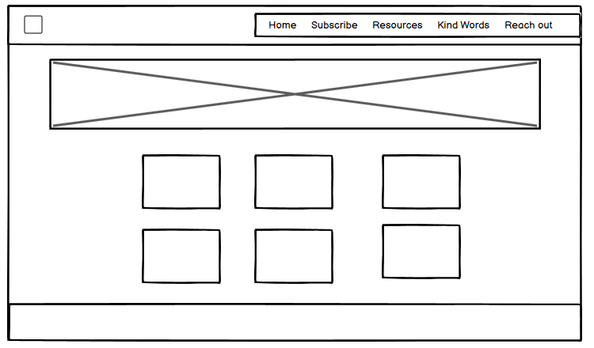
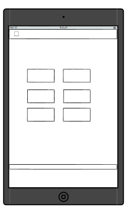
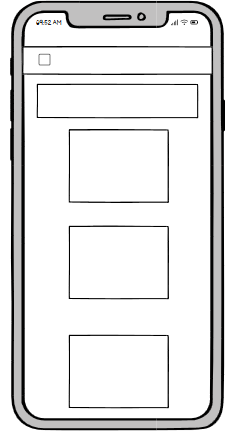
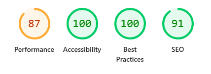

# Safeguarding Hub

Safeguarding Hub is a website designed to help users quickly identify the key principles of safeguarding, understand their meaning, and access advice on implementing them in various environments such as work, education, home, and community.

---

## Wireframes

 

## Table of Contents

- [User Stories](#User-stories)
- [UX Design](#UX-design)
- [Features](#features)
- [Features Left to Implement](#features-left-to-implement)
- [Testing](#testing)
- [Validator Testing](#validator-testing)
- [Unfixed Bugs](#unfixed-bugs)
- [Deployment](#deployment)
- [Credits](#credits)
- [Media](#media)

---
## User Stories
-  User friendly navigation and responsive design
-  Testimonials
-  Simple and intuitive layout
-  Principles of Safeguarding
-  Recognise and understand what safeguarding is

## UX Design
- **Colours**
    Earth colours chosen for a calming feel to the website. Blue and brown are often associated with nature, representing the earth and the sky. This natural pairing feels harmonious.
- **Font**
    Montserrat is relaxed, welcoming, friendly and easy on the eye for all ages, the neuro-diverse and people with learning difficulties.

## Features

### Existing Features

- **Navigation Bar**  
  Responsive navbar with dropdown menus for easy navigation across the site.

- **Landing Page**  
  Simple introduction to safeguarding, what it means and its importance.

- **Key Principles Cards**  
  Visually engaging cards explaining each safeguarding principle with supporting images and descriptions.

- **Footer**  
  Contains copyright and social media links.

- **Newsletter Page**  
  Link to newsletter

- **Resources Page**
  Link to Definitions of the Principles - also the link from the Home page on each card

- **Kind Words Page**
  Testimonials from site users

- **Reach Out Page**  
  Simple form to contact the site

---

## Features Left to Implement

- Add more detailed guides, resources, quizzes, self-assessment tools
- Modal pop-up for Submit form on Contact page

---

## Testing

- Manual testing on Chrome, Firefox, and Edge for responsiveness and usability.
- All links and dropdowns tested for correct navigation.
- Cards and buttons tested for accessibility and clarity.
- Lighthouse testing completed

---

## Validator Testing

- HTML and CSS validated using [W3C Validator](https://validator.w3.org/).
- No major errors found; minor warnings addressed.

---

## Unfixed Bugs

- None known

---

## Deployment

- The site is deployed on GitHub Pages at: https://andreafitz.github.io/safeguarding-hub/

- The site was deployed early in the development stage to check fundamentals worked.

### Running Locally
1. Clone the repository
2. Open `index.html` in your browser

---

## Credits

- Bootstrap for layout and components
- Font Awesome for icons
- Co-pilot for images and definitions
- GitHub co-pilot for code suggestions
- Squoosh for image compression

---

## Media

- All images and icons are either created by the author or sourced from free-to-use resources.

---

